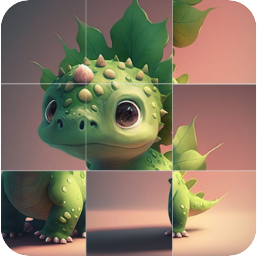

# Svelte Puzzle



Svelte Puzzle is a puzzle game built with Svelte for SvelteHack 2023. It shows how Svelte can be used together with Capacitor to build mobile apps for iOS and Android.

The game is officially available on App Store for iOS and Google Play Store for Android, see below.

## Demo 🚀

### Web

https://sveltepuzzle.toddler-games.com/

### Android

<a href="https://play.google.com/store/apps/details?id=com.toddlergames.sveltepuzzle">
  
</a>

### iOS

<a href="https://apps.apple.com/app/svelte-puzzle/id6447557105">
  
</a>

### Gif


## Svelte + Capacitor = ❤️

I tried different `Web -> Mobile` solutions and found that Capacitor is best to get started. Unlike some other frameworks, it really works out of the box with a couple of simple commands. Like this you can build a mobile app with Svelte in no time!

In this repo, the initial commands from capcitor have already been run, but if you want to get started in your own svelte project it's really as easy as:

```
npm i @capacitor/core @capacitor/android @capacitor/ios
npm i -D @capacitor/cli

npx cap init
npx cap add android
npx cap add ios
```

BOOM💥, you now have mobile apps. The only thing left to do for a Svelte app built with Svelte Kit and SSG is change `dist` to `build` in `capacitor.config.ts`.

To run and build the android version, install Android Studio and open the `android` folder.

To run and build the iOS version, you need Xcode and then run `npx cap open ios`.

Below you find the link to a youtube video I created on those steps.

[](https://www.youtube.com/watch?v=rlNms8xoLXo)

## Local Development

All useful commands are encoded in the `package.json`, but here's how to get started:

```
npm ci
npm start
```

You need at least node v16.

To sync code changes into the iOS and Android projects do a `npm run capsync`.

## Awesome tips & tricks 😎

I've learnt a lot building this project and I like to share. Here are a couple of awesome tips & tricks I've learnt along the way: [Awesome tips & tricks](./AWESOME.md) .
